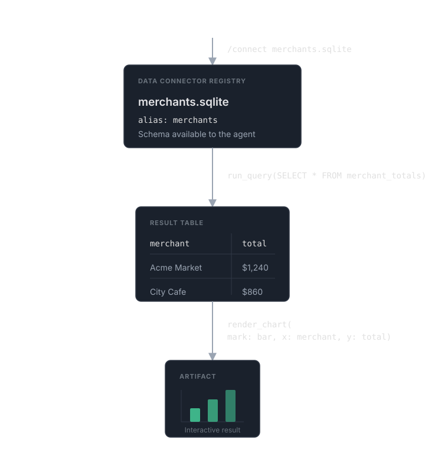

# What is TabulaFlow?

TabulaFlow is an open-source data agent built on a modular Python library.

Think of it as Claude Code for data: describe in natural language what you want
to analyze, visualize, or transform across databases, spreadsheets and other
local files, public datasets, and the web. Like a general-purpose coding agent,
it can also write code, work with files, run shell commands, and browse the web.

<figure class="media-placeholder media-placeholder--video" aria-label="Placeholder for the TabulaFlow product demo video">
  

    Video · 16:9 · 20–30 seconds
    <strong>From question to interactive result</strong>
    Show a user entering a request, the agent working, the completed chart, and the Chart, Data, and Query views.
  

  <figcaption>Production placeholder · Include captions and a text transcript.</figcaption>
</figure>

## How is TabulaFlow different?

General-purpose coding agents (e.g., Claude Code) are built around files, but
TabulaFlow treats tables as first-class citizens, as its name suggests. We
design TabulaFlow around a table-native agent harness for tasks that existing
agents are not built to handle.

Many database-focused data agents (e.g., Chat2DB) focus on SQL generation.
TabulaFlow supports broader workflows across relational and graph databases,
local files, public datasets, and the web.

- **Interactive visualization.** Create charts, maps, and relationship graphs
  backed by queryable, parameterized data, including graphs from Neo4j.
- **Multimodal data browsing.** Browse images, PDFs, and other media directly
  inside tables, or ask an agent to analyze them alongside the other data.
- **Large-scale dataset construction.** Combine multiple sources and turn
  unstructured web pages and documents into structured, normalized tables with
  thousands of rows.
- **Parallel semantic operations.** Enrich tables with new columns by
  coordinating thousands of row-wise subagents in parallel to collect
  information, classify records, and annotate data.
- **Parallel browser use.** TabulaFlow's browser harness lets agents interact
  with many web pages in parallel during complex deep research tasks, including
  pages that require clicks and forms.
- **Async-native Python library.** The core of TabulaFlow is a library written
  in pure Python. Build your own data application with components at any level,
  from data connectors to agent tools.

## Build and research with TabulaFlow

### Python Library

We build TabulaFlow not only as an end-user application but also as an
async-native Python library with clean, minimal building blocks for modern data
agents, from data connectors to agent tools. You can use them to create agents
and applications tailored to your needs.
[Explore the library →](python-library/index.md)

### Research Toolkit

TabulaFlow also includes a research toolkit for rapid, large-scale
experimentation on text-to-SQL and text-to-Cypher benchmarks such as Spider
2.0, CypherBench, and ARCS. [Explore the toolkit →](research-toolkit/index.md)

## How does TabulaFlow work?

The diagram below shows how TabulaFlow works, using SQLite as an example. You
can connect the database with `/connect`, or the agent can connect it through a
tool call. TabulaFlow registers the connection under an alias and makes the
schema available to the agent. The agent can then execute queries, save
intermediate results to a local workspace for further processing, and
attach visualization specifications to render charts, maps, and graphs.
This enables a fully in-memory agentic data workflow without exposing a shell
tool when security matters.

<figure class="workflow-diagram">
  
  <figcaption>From a database connection to an interactive result.</figcaption>
</figure>

Connected sources are read-only. To complete a task, the agent can transform
tables in a local workspace and keep intermediate files in a temporary scratch
directory, so your source data and project directory remain unchanged by
default. To export results to local files, simply ask the agent in natural
language.

!!! note "Public beta"
    TabulaFlow 0.1.0 is a public beta. Patch releases preserve documented
    public APIs; minor `0.x` releases may include documented breaking changes.
    We welcome your feedback.
