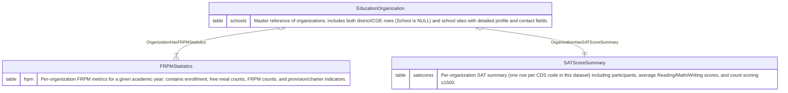

```mermaid
erDiagram
    EducationOrganization {
        table schools "Master reference of organizations; includes both district/COE rows (School is NULL) and school sites with detailed profile and contact fields."
    }
    FRPMStatistics {
        table frpm "Per-organization FRPM metrics for a given academic year; contains enrollment, free meal counts, FRPM counts, and provision/charter indicators."
    }
    SATScoreSummary {
        table satscores "Per-organization SAT summary (one row per CDS code in this dataset) including participants, average Reading/Math/Writing scores, and count scoring ≥1500."
    }

    EducationOrganization |o--|{ FRPMStatistics : "OrganizationHasFRPMStatistics"
    %% Each FRPM statistics record belongs to exactly one education organization; an organization may have zero or many FRPM statistics records across academic years.
    %% SQL join path: `FROM frpm JOIN schools ON frpm.CDSCode = schools.CDSCode`

    EducationOrganization |o--|| SATScoreSummary : "OrganizationHasSATScoreSummary"
    %% Each SAT score summary (in this snapshot) belongs to exactly one education organization; an organization may have zero or one SAT score summary row.
    %% SQL join path: `FROM satscores JOIN schools ON satscores.cds = schools.CDSCode`
```