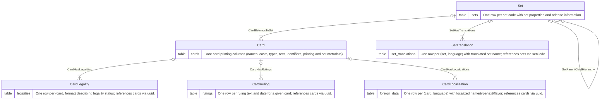

```mermaid
erDiagram
    Card {
        table cards "Core card printing columns (names, costs, types, text, identifiers, printing and set metadata)."
    }
    Set {
        table sets "One row per set code with set properties and release information."
    }
    CardLegality {
        table legalities "One row per (card, format) describing legality status; references cards via uuid."
    }
    CardRuling {
        table rulings "One row per ruling text and date for a given card; references cards via uuid."
    }
    CardLocalization {
        table foreign_data "One row per (card, language) with localized name/type/text/flavor; references cards via uuid."
    }
    SetTranslation {
        table set_translations "One row per (set, language) with translated set name; references sets via setCode."
    }

    %% FROM cards JOIN sets ON cards.setCode = sets.code

    Set |o--|{ Card : "CardBelongsToSet"
    %% FROM cards JOIN legalities ON cards.uuid = legalities.uuid

    Card |o--|{ CardLegality : "CardHasLegalities"
    %% FROM cards JOIN rulings ON cards.uuid = rulings.uuid

    Card |o--|{ CardRuling : "CardHasRulings"
    %% FROM cards JOIN foreign_data ON cards.uuid = foreign_data.uuid

    Card |o--|{ CardLocalization : "CardHasLocalizations"
    %% FROM sets JOIN set_translations ON sets.code = set_translations.setCode

    Set |o--|{ SetTranslation : "SetHasTranslations"
    %% FROM sets AS childSet LEFT JOIN sets AS parentSet ON childSet.parentCode = parentSet.code

    Set |o--o{ Set : "SetParentChildHierarchy"
```