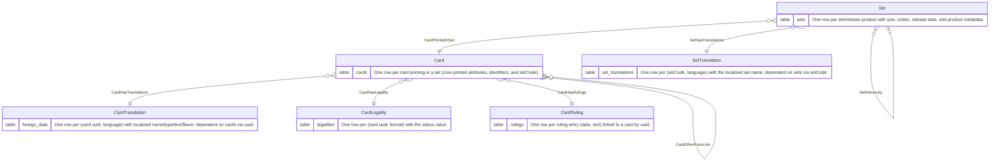

```mermaid
erDiagram
    Card {
        table cards "One row per card printing in a set (core printed attributes, identifiers, and setCode)."
    }
    Set {
        table sets "One row per set/release product with size, codes, release date, and product metadata."
    }
    CardTranslation {
        table foreign_data "One row per (card uuid, language) with localized name/type/text/flavor; dependent on cards via uuid."
    }
    CardLegality {
        table legalities "One row per (card uuid, format) with the status value."
    }
    CardRuling {
        table rulings "One row per ruling entry (date, text) linked to a card by uuid."
    }
    SetTranslation {
        table set_translations "One row per (setCode, language) with the localized set name; dependent on sets via setCode."
    }

    %% FROM cards JOIN sets ON cards.setCode = sets.code
    Set }o--|| Card : "CardPrintedInSet"

    %% FROM cards JOIN foreign_data ON foreign_data.uuid = cards.uuid
    Card }o--|| CardTranslation : "CardHasTranslations"

    %% FROM cards JOIN legalities ON legalities.uuid = cards.uuid
    Card }o--|| CardLegality : "CardHasLegality"

    %% FROM cards JOIN rulings ON rulings.uuid = cards.uuid
    Card }o--|| CardRuling : "CardHasRulings"

    %% FROM sets JOIN set_translations ON set_translations.setCode = sets.code
    Set }o--|| SetTranslation : "SetHasTranslations"

    %% FROM cards c1 JOIN cards c2 ON (',' || COALESCE(c1.otherFaceIds, '') || ',') LIKE '%,' || c2.uuid || ',%'
    Card }o--o{ Card : "CardOtherFaceLink"

    %% FROM sets child JOIN sets parent ON child.parentCode = parent.code
    Set }o--o| Set : "SetHierarchy"
```