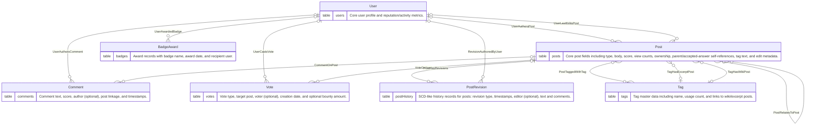

```mermaid
erDiagram
    Post {
        table posts "Core post fields including type, body, score, view counts, ownership, parent/accepted-answer self-references, tag text, and edit metadata."
    }
    User {
        table users "Core user profile and reputation/activity metrics."
    }
    Comment {
        table comments "Comment text, score, author (optional), post linkage, and timestamps."
    }
    Vote {
        table votes "Vote type, target post, voter (optional), creation date, and optional bounty amount."
    }
    PostRevision {
        table postHistory "SCD-like history records for posts: revision type, timestamps, editor (optional), text and comments."
    }
    BadgeAward {
        table badges "Award records with badge name, award date, and recipient user."
    }
    Tag {
        table tags "Tag master data including name, usage count, and links to wiki/excerpt posts."
    }
    User |o--o{ Post : "UserAuthorsPost"
    User |o--o{ Post : "UserLastEditsPost"
    Post |o--o| Post : "PostHasAcceptedAnswer"
    Post }o--o| Post : "PostAnswerOfQuestion"
    User |o--o{ Comment : "UserAuthorsComment"
    Post |o--o{ Comment : "CommentOnPost"
    User |o--o{ Vote : "UserCastsVote"
    Post |o--o{ Vote : "VoteOnPost"
    User |o--o{ BadgeAward : "UserAwardedBadge"
    Post |o--o{ PostRevision : "PostHasRevisions"
    User |o--o{ PostRevision : "RevisionAuthoredByUser"
    Tag |o--o{ Post : "TagHasExcerptPost"
    Tag |o--o{ Post : "TagHasWikiPost"
    Post }o--o{ Tag : "PostTaggedWithTag"
    Post }o--o{ Post : "PostRelatesToPost"
```