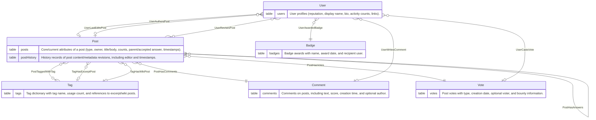

```mermaid
erDiagram
    Post {
        table posts "Core/current attributes of a post (type, owner, title/body, counts, parent/accepted answer, timestamps)."
        table postHistory "History records of post content/metadata revisions, including editor and timestamps."
    }
    User {
        table users "User profiles (reputation, display name, bio, activity counts, links)."
    }
    Tag {
        table tags "Tag dictionary with tag name, usage count, and references to excerpt/wiki posts."
    }
    Comment {
        table comments "Comments on posts, including text, score, creation time, and optional author."
    }
    Vote {
        table votes "Post votes with type, creation date, optional voter, and bounty information."
    }
    Badge {
        table badges "Badge awards with name, award date, and recipient user."
    }

    User }o--o| Post : "UserAuthorsPost"
    %% A user may author many posts; a post has at most one author and can be anonymously owned.
    %% SQL join path: `FROM posts p JOIN users u ON p.OwnerUserId = u.Id`

    User }o--o| Post : "UserLastEditsPost"
    %% A user may be the most recent editor of many posts; a post has at most one last editor.
    %% SQL join path: `FROM posts p JOIN users u ON p.LastEditorUserId = u.Id`

    User }o--o{ Post : "UserRevisesPost"
    %% Users create revision records for posts over time (post history).
    %% SQL join path: `FROM postHistory ph JOIN posts p ON ph.PostId = p.Id JOIN users u ON ph.UserId = u.Id`

    Post }o--|| Comment : "PostHasComments"
    %% A post can have many comments; each comment belongs to exactly one post.
    %% SQL join path: `FROM posts p JOIN comments c ON c.PostId = p.Id`

    User }o--o| Comment : "UserWritesComment"
    %% A user may write many comments; a comment may have a single registered author or be anonymous.
    %% SQL join path: `FROM comments c JOIN users u ON c.UserId = u.Id`

    Post }o--|| Vote : "PostHasVotes"
    %% A post can receive many votes; each vote is on exactly one post.
    %% SQL join path: `FROM posts p JOIN votes v ON v.PostId = p.Id`

    User }o--o| Vote : "UserCastsVote"
    %% A user may cast many votes; a vote may have an associated voter (some votes are anonymous or system-generated).
    %% SQL join path: `FROM votes v JOIN users u ON v.UserId = u.Id`

    User }o--|| Badge : "UserAwardedBadge"
    %% Users can receive many badges; each badge is awarded to one user.
    %% SQL join path: `FROM users u JOIN badges b ON b.UserId = u.Id`

    Post }o--o{ Post : "PostRelatedToPost"
    %% Posts can be related to other posts via explicit links (e.g., duplicates, related).
    %% SQL join path: `FROM postLinks pl JOIN posts p_src ON pl.PostId = p_src.Id JOIN posts p_tgt ON pl.RelatedPostId = p_tgt.Id`

    Post |o--o| Post : "PostAcceptsAnswer"
    %% A question post may accept at most one answer post; an answer may be accepted by at most one question.
    %% SQL join path: `FROM posts q JOIN posts a ON q.AcceptedAnswerId = a.Id`

    Post }o--|| Post : "PostHasAnswers"
    %% A question post can have many answer posts; each answer references exactly one parent question.
    %% SQL join path: `FROM posts q JOIN posts a ON a.ParentId = q.Id`

    Post }o--o{ Tag : "PostTaggedWithTag"
    %% Posts are tagged with zero or more tags; implemented as a denormalized tag string on posts matched to the tag name.
    %% SQL join path: `FROM posts p JOIN tags t ON p.Tags LIKE '%' || '<' || t.TagName || '>' || '%'`

    Tag |o--o{ Post : "TagHasExcerptPost"
    %% A tag may reference a single excerpt post that describes it; a post may be the excerpt for multiple tags.
    %% SQL join path: `FROM tags t JOIN posts p ON t.ExcerptPostId = p.Id`

    Tag |o--o{ Post : "TagHasWikiPost"
    %% A tag may reference a single wiki post that documents it; a post may be the wiki for multiple tags.
    %% SQL join path: `FROM tags t JOIN posts p ON t.WikiPostId = p.Id`
```