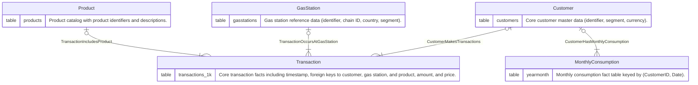

```mermaid
erDiagram
    Transaction {
        table transactions_1k "Core transaction facts including timestamp, foreign keys to customer, gas station, and product, amount, and price."
    }
    Customer {
        table customers "Core customer master data (identifier, segment, currency)."
    }
    GasStation {
        table gasstations "Gas station reference data (identifier, chain ID, country, segment)."
    }
    Product {
        table products "Product catalog with product identifiers and descriptions."
    }
    MonthlyConsumption {
        table yearmonth "Monthly consumption fact table keyed by (CustomerID, Date)."
    }

    %% FROM transactions_1k t JOIN customers c ON c.CustomerID = t.CustomerID
    Customer |o--|{ Transaction : "CustomerMakesTransactions"

    %% FROM transactions_1k t JOIN gasstations g ON g.GasStationID = t.GasStationID
    GasStation |o--|{ Transaction : "TransactionOccursAtGasStation"

    %% FROM transactions_1k t JOIN products p ON p.ProductID = t.ProductID
    Product |o--|{ Transaction : "TransactionIncludesProduct"

    %% FROM yearmonth ym JOIN customers c ON c.CustomerID = ym.CustomerID
    Customer |o--|{ MonthlyConsumption : "CustomerHasMonthlyConsumption"
```