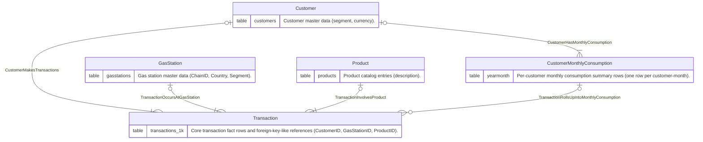

```mermaid
erDiagram
    Transaction {
        table transactions_1k "Core transaction fact rows and foreign-key-like references (CustomerID, GasStationID, ProductID)."
    }
    Customer {
        table customers "Customer master data (segment, currency)."
    }
    GasStation {
        table gasstations "Gas station master data (ChainID, Country, Segment)."
    }
    Product {
        table products "Product catalog entries (description)."
    }
    CustomerMonthlyConsumption {
        table yearmonth "Per-customer monthly consumption summary rows (one row per customer-month)."
    }
    %% FROM transactions_1k t JOIN customers c ON c.CustomerID = t.CustomerID
    Customer |o--|{ Transaction : "CustomerMakesTransactions"
    %% FROM transactions_1k t JOIN gasstations g ON g.GasStationID = t.GasStationID
    GasStation |o--|{ Transaction : "TransactionOccursAtGasStation"
    %% FROM transactions_1k t JOIN products p ON p.ProductID = t.ProductID
    Product |o--|{ Transaction : "TransactionInvolvesProduct"
    %% FROM customers c JOIN yearmonth ym ON ym.CustomerID = c.CustomerID
    Customer |o--|{ CustomerMonthlyConsumption : "CustomerHasMonthlyConsumption"
    %% FROM transactions_1k t JOIN yearmonth ym   ON ym.CustomerID = t.CustomerID  AND ym.Date = strftime('%Y%m', t.Date)
    CustomerMonthlyConsumption |o--o{ Transaction : "TransactionRollsUpIntoMonthlyConsumption"
```