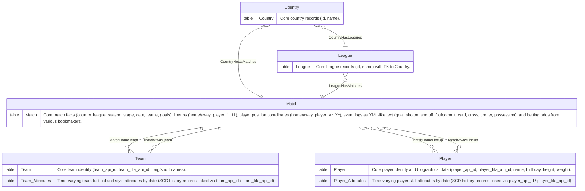

```mermaid
erDiagram
    Match {
        table Match "Core match facts (country, league, season, stage, date, teams, goals), lineups (home/away_player_1..11), player position coordinates (home/away_player_X*, Y*), event logs as XML-like text (goal, shoton, shotoff, foulcommit, card, cross, corner, possession), and betting odds from various bookmakers."
    }
    Country {
        table Country "Core country records (id, name)."
    }
    League {
        table League "Core league records (id, name) with FK to Country."
    }
    Team {
        table Team "Core team identity (team_api_id, team_fifa_api_id, long/short names)."
        table Team_Attributes "Time-varying team tactical and style attributes by date (SCD history records linked via team_api_id / team_fifa_api_id)."
    }
    Player {
        table Player "Core player identity and biographical data (player_api_id, player_fifa_api_id, name, birthday, height, weight)."
        table Player_Attributes "Time-varying player skill attributes by date (SCD history records linked via player_api_id / player_fifa_api_id)."
    }

    %% FROM League l JOIN Country c ON l.country_id = c.id
    Country }o--|| League : "CountryHasLeagues"

    %% FROM Match m JOIN Country c ON m.country_id = c.id
    Country }o--|| Match : "CountryHostsMatches"

    %% FROM Match m JOIN League l ON m.league_id = l.id
    League }o--|| Match : "LeagueHasMatches"

    %% FROM Match m JOIN Team t ON t.team_api_id = m.home_team_api_id
    Match ||--o{ Team : "MatchHomeTeam"

    %% FROM Match m JOIN Team t ON t.team_api_id = m.away_team_api_id
    Match ||--o{ Team : "MatchAwayTeam"

    %% FROM Match m JOIN Player p ON p.player_api_id IN (m.home_player_1, m.home_player_2, m.home_player_3, m.home_player_4, m.home_player_5, m.home_player_6, m.home_player_7, m.home_player_8, m.home_player_9, m.home_player_10, m.home_player_11)
    Match }o--o{ Player : "MatchHomeLineup"

    %% FROM Match m JOIN Player p ON p.player_api_id IN (m.away_player_1, m.away_player_2, m.away_player_3, m.away_player_4, m.away_player_5, m.away_player_6, m.away_player_7, m.away_player_8, m.away_player_9, m.away_player_10, m.away_player_11)
    Match }o--o{ Player : "MatchAwayLineup"
```