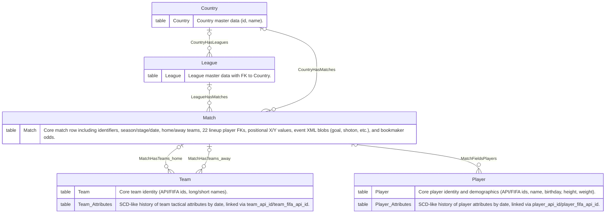

```mermaid
erDiagram
    Match {
        table Match "Core match row including identifiers, season/stage/date, home/away teams, 22 lineup player FKs, positional X/Y values, event XML blobs (goal, shoton, etc.), and bookmaker odds."
    }
    Country {
        table Country "Country master data (id, name)."
    }
    League {
        table League "League master data with FK to Country."
    }
    Team {
        table Team "Core team identity (API/FIFA ids, long/short names)."
        table Team_Attributes "SCD-like history of team tactical attributes by date, linked via team_api_id/team_fifa_api_id."
    }
    Player {
        table Player "Core player identity and demographics (API/FIFA ids, name, birthday, height, weight)."
        table Player_Attributes "SCD-like history of player attributes by date, linked via player_api_id/player_fifa_api_id."
    }

    %% FROM Country c JOIN League l ON l.country_id = c.id

    Country |o--o{ League : "CountryHasLeagues"
    %% FROM League l JOIN Match m ON m.league_id = l.id

    League |o--o{ Match : "LeagueHasMatches"
    %% FROM Country c JOIN Match m ON m.country_id = c.id

    Country |o--o{ Match : "CountryHasMatches"
    %% FROM Match m LEFT JOIN Team home ON home.team_api_id = m.home_team_api_id LEFT JOIN Team away ON away.team_api_id = m.away_team_api_id

    Match |o--o{ Team : "MatchHasTeams_home"

    Match |o--o{ Team : "MatchHasTeams_away"
    %% FROM Match m LEFT JOIN LATERAL (   SELECT m.home_player_1 AS player_api_id, 'home' AS side, 1 AS slot   UNION ALL SELECT m.home_player_2, 'home', 2   UNION ALL SELECT m.home_player_3, 'home', 3   UNION ALL SELECT m.home_player_4, 'home', 4   UNION ALL SELECT m.home_player_5, 'home', 5   UNION ALL SELECT m.home_player_6, 'home', 6   UNION ALL SELECT m.home_player_7, 'home', 7   UNION ALL SELECT m.home_player_8, 'home', 8   UNION ALL SELECT m.home_player_9, 'home', 9   UNION ALL SELECT m.home_player_10, 'home', 10   UNION ALL SELECT m.home_player_11, 'home', 11   UNION ALL SELECT m.away_player_1, 'away', 1   UNION ALL SELECT m.away_player_2, 'away', 2   UNION ALL SELECT m.away_player_3, 'away', 3   UNION ALL SELECT m.away_player_4, 'away', 4   UNION ALL SELECT m.away_player_5, 'away', 5   UNION ALL SELECT m.away_player_6, 'away', 6   UNION ALL SELECT m.away_player_7, 'away', 7   UNION ALL SELECT m.away_player_8, 'away', 8   UNION ALL SELECT m.away_player_9, 'away', 9   UNION ALL SELECT m.away_player_10, 'away', 10   UNION ALL SELECT m.away_player_11, 'away', 11 ) lu ON TRUE LEFT JOIN Player p ON p.player_api_id = lu.player_api_id

    Match |o--o{ Player : "MatchFieldsPlayers"
```