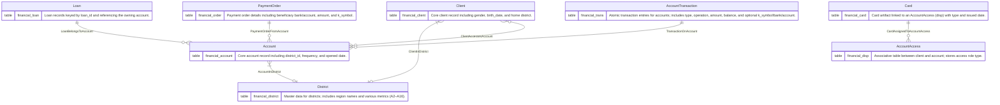

```mermaid
erDiagram
    Account {
        table financial_account "Core account record including district_id, frequency, and opened date."
    }
    District {
        table financial_district "Master data for districts; includes region names and various metrics (A2–A16)."
    }
    Client {
        table financial_client "Core client record including gender, birth_date, and home district."
    }
    AccountAccess {
        table financial_disp "Associative table between client and account; stores access role type."
    }
    Card {
        table financial_card "Card artifact linked to an AccountAccess (disp) with type and issued date."
    }
    Loan {
        table financial_loan "Loan records keyed by loan_id and referencing the owning account."
    }
    PaymentOrder {
        table financial_order "Payment order details including beneficiary bank/account, amount, and k_symbol."
    }
    AccountTransaction {
        table financial_trans "Atomic transaction entries for accounts; includes type, operation, amount, balance, and optional k_symbol/bank/account."
    }

    %% FROM account JOIN district ON account.district_id = district.district_id
    Account }|--o| District : "AccountInDistrict"

    %% FROM client JOIN district ON client.district_id = district.district_id
    Client }|--o| District : "ClientInDistrict"

    %% FROM client JOIN disp ON disp.client_id = client.client_id JOIN account ON account.account_id = disp.account_id
    Client }o--o{ Account : "ClientAccessesAccount"

    %% FROM card JOIN disp ON card.disp_id = disp.disp_id
    Card ||--o{ AccountAccess : "CardAssignedToAccountAccess"

    %% FROM loan JOIN account ON loan.account_id = account.account_id
    Loan ||--o{ Account : "LoanBelongsToAccount"

    %% FROM "order" JOIN account ON "order".account_id = account.account_id
    PaymentOrder ||--o{ Account : "PaymentOrderFromAccount"

    %% FROM trans JOIN account ON trans.account_id = account.account_id
    AccountTransaction ||--o{ Account : "TransactionOnAccount"
```