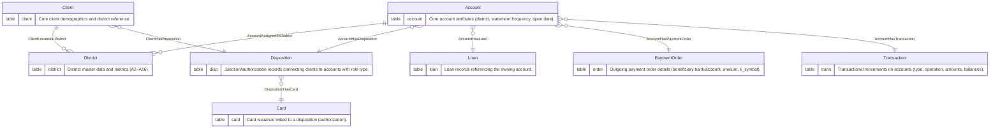

```mermaid
erDiagram
    Account {
        table account "Core account attributes (district, statement frequency, open date)."
    }
    Client {
        table client "Core client demographics and district reference."
    }
    District {
        table district "District master data and metrics (A2–A16)."
    }
    Disposition {
        table disp "Junction/authorization records connecting clients to accounts with role type."
    }
    Card {
        table card "Card issuance linked to a disposition (authorization)."
    }
    Loan {
        table loan "Loan records referencing the owning account."
    }
    PaymentOrder {
        table order "Outgoing payment order details (beneficiary bank/account, amount, k_symbol)."
    }
    Transaction {
        table trans "Transactional movements on accounts (type, operation, amounts, balances)."
    }

    %% FROM account JOIN district ON account.district_id = district.district_id
    Account ||--o{ District : "AccountAssignedToDistrict"

    %% FROM client JOIN district ON client.district_id = district.district_id
    Client ||--o{ District : "ClientLocatedInDistrict"

    %% FROM disp JOIN client ON disp.client_id = client.client_id
    Client }o--|| Disposition : "ClientHasDisposition"

    %% FROM account JOIN disp ON account.account_id = disp.account_id
    Account }o--|| Disposition : "AccountHasDisposition"

    %% FROM disp JOIN card ON card.disp_id = disp.disp_id
    Disposition }o--|| Card : "DispositionHasCard"

    %% FROM account JOIN loan ON account.account_id = loan.account_id
    Account }o--|| Loan : "AccountHasLoan"

    %% FROM account JOIN "order" ON account.account_id = "order".account_id
    Account }o--|| PaymentOrder : "AccountHasPaymentOrder"

    %% FROM account JOIN trans ON account.account_id = trans.account_id
    Account }o--|| Transaction : "AccountHasTransaction"
```