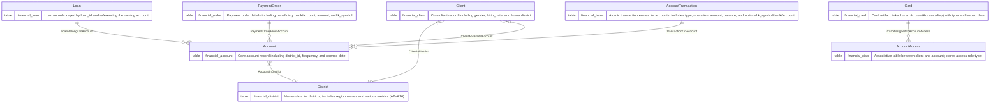

```mermaid
erDiagram
    Account {
        table financial_account "Core account record including district_id, frequency, and opened date."
    }
    District {
        table financial_district "Master data for districts; includes region names and various metrics (A2–A16)."
    }
    Client {
        table financial_client "Core client record including gender, birth_date, and home district."
    }
    AccountAccess {
        table financial_disp "Associative table between client and account; stores access role type."
    }
    Card {
        table financial_card "Card artifact linked to an AccountAccess (disp) with type and issued date."
    }
    Loan {
        table financial_loan "Loan records keyed by loan_id and referencing the owning account."
    }
    PaymentOrder {
        table financial_order "Payment order details including beneficiary bank/account, amount, and k_symbol."
    }
    AccountTransaction {
        table financial_trans "Atomic transaction entries for accounts; includes type, operation, amount, balance, and optional k_symbol/bank/account."
    }
    Account }|--o| District : "AccountInDistrict"
    Client }|--o| District : "ClientInDistrict"
    Client }o--o{ Account : "ClientAccessesAccount"
    Card ||--o{ AccountAccess : "CardAssignedToAccountAccess"
    Loan ||--o{ Account : "LoanBelongsToAccount"
    PaymentOrder ||--o{ Account : "PaymentOrderFromAccount"
    AccountTransaction ||--o{ Account : "TransactionOnAccount"
```