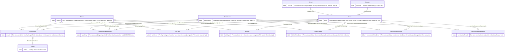

```mermaid
erDiagram
    Race {
        table races "Core race metadata: season year, round, circuit link, name, date/time, and reference URL."
    }
    Driver {
        table drivers "Core driver identity and demographics: code/number, name, DOB, nationality, and URL."
    }
    Constructor {
        table constructors "Core constructor/team identity: reference key, name, nationality, and URL."
    }
    Circuit {
        table circuits "Venue details including location, country, latitude/longitude, altitude, and URL."
    }
    Season {
        table seasons "Season reference by year and URL."
    }
    RaceResult {
        table results "Per-race, per-driver result with grid/finish data, timing metrics, points, and status reference."
    }
    QualifyingSessionResult {
        table qualifying "Per-race qualifying entry with driver/constructor, position, and Q1/Q2/Q3 times."
    }
    LapTime {
        table lapTimes "Per-lap timing and position for a driver in a race (composite PK: raceId, driverId, lap)."
    }
    PitStop {
        table pitStops "Per-stop timing for a driver in a race (composite PK: raceId, driverId, stop)."
    }
    DriverStanding {
        table driverStandings "Per-race cumulative driver standings with points, position, positionText, and wins."
    }
    ConstructorStanding {
        table constructorStandings "Per-race cumulative constructor standings with points, position, positionText, and wins."
    }
    ConstructorRaceResult {
        table constructorResults "Per-race constructor result/points and optional status text."
    }
    Status {
        table status "Lookup of race result statuses."
    }

    Season |o--|{ Race : "RaceInSeason"
    %% Each race belongs to one season; a season has many races.
    %% SQL join path: `FROM races r JOIN seasons s ON r.year = s.year`

    Circuit |o--|{ Race : "RaceAtCircuit"
    %% Each race is hosted at one circuit; a circuit hosts many races.
    %% SQL join path: `FROM races r JOIN circuits c ON r.circuitId = c.circuitId`

    Race |o--|{ RaceResult : "RaceHasRaceResults"
    %% A race yields many driver result entries; each result pertains to one race.
    %% SQL join path: `FROM races ra JOIN results rr ON rr.raceId = ra.raceId`

    Driver |o--|{ RaceResult : "DriverHasRaceResults"
    %% A driver accumulates many race result entries; each result is for one driver.
    %% SQL join path: `FROM drivers d JOIN results rr ON rr.driverId = d.driverId`

    Constructor |o--|{ RaceResult : "ConstructorHasRaceResults"
    %% A constructor accrues many race result entries through its drivers; each result references one constructor.
    %% SQL join path: `FROM constructors c JOIN results rr ON rr.constructorId = c.constructorId`

    RaceResult }|--o| Status : "RaceResultHasStatus"
    %% Each race result has one finishing status; a status value can be used by many results.
    %% SQL join path: `FROM results rr JOIN status s ON rr.statusId = s.statusId`

    Race |o--|{ LapTime : "RaceHasLapTimes"
    %% A race has many lap time records; each lap time belongs to one race.
    %% SQL join path: `FROM races r JOIN lapTimes lt ON lt.raceId = r.raceId`

    Driver |o--|{ LapTime : "DriverHasLapTimes"
    %% A driver produces many lap time records; each lap time is for one driver.
    %% SQL join path: `FROM drivers d JOIN lapTimes lt ON lt.driverId = d.driverId`

    Race |o--|{ PitStop : "RaceHasPitStops"
    %% A race includes many pit stop events; each pit stop belongs to one race.
    %% SQL join path: `FROM races r JOIN pitStops ps ON ps.raceId = r.raceId`

    Driver |o--|{ PitStop : "DriverHasPitStops"
    %% A driver performs many pit stops; each pit stop is for one driver.
    %% SQL join path: `FROM drivers d JOIN pitStops ps ON ps.driverId = d.driverId`

    Race |o--|{ QualifyingSessionResult : "RaceHasQualifyingResults"
    %% A race has many qualifying session results; each qualifying result is for one race.
    %% SQL join path: `FROM races r JOIN qualifying q ON q.raceId = r.raceId`

    Driver |o--|{ QualifyingSessionResult : "DriverHasQualifyingResults"
    %% A driver has qualifying entries across races; each qualifying entry references one driver.
    %% SQL join path: `FROM drivers d JOIN qualifying q ON q.driverId = d.driverId`

    Constructor |o--|{ QualifyingSessionResult : "ConstructorHasQualifyingResults"
    %% A constructor is associated with many qualifying entries; each qualifying entry references one constructor.
    %% SQL join path: `FROM constructors c JOIN qualifying q ON q.constructorId = c.constructorId`

    Race |o--|{ DriverStanding : "RaceHasDriverStandings"
    %% Each race defines a snapshot of cumulative driver standings; multiple standings rows exist per race.
    %% SQL join path: `FROM races r JOIN driverStandings ds ON ds.raceId = r.raceId`

    Driver |o--|{ DriverStanding : "DriverHasDriverStandings"
    %% Each driver has many cumulative standing rows across races; each row references one driver.
    %% SQL join path: `FROM drivers d JOIN driverStandings ds ON ds.driverId = d.driverId`

    Race |o--|{ ConstructorStanding : "RaceHasConstructorStandings"
    %% Each race defines a snapshot of cumulative constructor standings; multiple standings rows exist per race.
    %% SQL join path: `FROM races r JOIN constructorStandings cs ON cs.raceId = r.raceId`

    Constructor |o--|{ ConstructorStanding : "ConstructorHasConstructorStandings"
    %% Each constructor has many cumulative standing rows across races; each row references one constructor.
    %% SQL join path: `FROM constructors c JOIN constructorStandings cs ON cs.constructorId = c.constructorId`

    Race |o--|{ ConstructorRaceResult : "RaceHasConstructorRaceResults"
    %% A race yields many constructor result entries; each constructor race result pertains to one race.
    %% SQL join path: `FROM races r JOIN constructorResults cr ON cr.raceId = r.raceId`

    Constructor |o--|{ ConstructorRaceResult : "ConstructorHasConstructorRaceResults"
    %% A constructor accrues many constructor race result entries; each entry references one constructor.
    %% SQL join path: `FROM constructors c JOIN constructorResults cr ON cr.constructorId = c.constructorId`
```