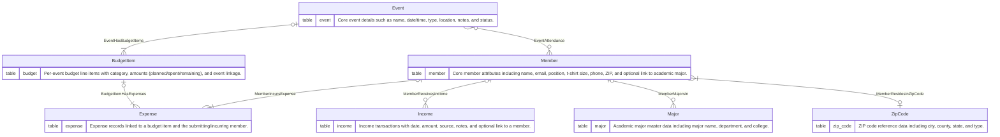

```mermaid
erDiagram
    Member {
        table member "Core member attributes including name, email, position, t-shirt size, phone, ZIP, and optional link to academic major."
    }
    Event {
        table event "Core event details such as name, date/time, type, location, notes, and status."
    }
    Major {
        table major "Academic major master data including major name, department, and college."
    }
    ZipCode {
        table zip_code "ZIP code reference data including city, county, state, and type."
    }
    BudgetItem {
        table budget "Per-event budget line items with category, amounts (planned/spent/remaining), and event linkage."
    }
    Expense {
        table expense "Expense records linked to a budget item and the submitting/incurring member."
    }
    Income {
        table income "Income transactions with date, amount, source, notes, and optional link to a member."
    }

    Event }o--o{ Member : "EventAttendance"
    %% Members attend events; attendance is modeled via a junction table capturing which member attended which event.
    %% SQL join path: `FROM event e JOIN attendance a ON a.link_to_event = e.event_id JOIN member m ON a.link_to_member = m.member_id`

    Event |o--|{ BudgetItem : "EventHasBudgetItems"
    %% Each event may define multiple budget line items; each budget item belongs to exactly one event.
    %% SQL join path: `FROM event e JOIN budget b ON b.link_to_event = e.event_id`

    BudgetItem |o--|{ Expense : "BudgetItemHasExpenses"
    %% Budget line items can have many expenses recorded against them; each expense must reference one budget item.
    %% SQL join path: `FROM budget b JOIN expense x ON x.link_to_budget = b.budget_id`

    Member |o--|{ Expense : "MemberIncursExpense"
    %% Expenses are submitted or incurred by a specific member.
    %% SQL join path: `FROM member m JOIN expense x ON x.link_to_member = m.member_id`

    Member |o--o{ Income : "MemberReceivesIncome"
    %% Income receipts can optionally be attributed to a member (e.g., dues).
    %% SQL join path: `FROM income i LEFT JOIN member m ON i.link_to_member = m.member_id`

    Member |o--o{ Major : "MemberMajorsIn"
    %% Members may be associated with one academic major; each major can have many members.
    %% SQL join path: `FROM member m LEFT JOIN major j ON m.link_to_major = j.major_id`

    Member }|--o| ZipCode : "MemberResidesInZipCode"
    %% Every member record references a ZIP code; each ZIP code can correspond to many members.
    %% SQL join path: `FROM member m JOIN zip_code z ON m.zip = z.zip_code`
```