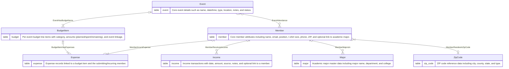

```mermaid
erDiagram
    Member {
        table member "Core member attributes including name, email, position, t-shirt size, phone, ZIP, and optional link to academic major."
    }
    Event {
        table event "Core event details such as name, date/time, type, location, notes, and status."
    }
    Major {
        table major "Academic major master data including major name, department, and college."
    }
    ZipCode {
        table zip_code "ZIP code reference data including city, county, state, and type."
    }
    BudgetItem {
        table budget "Per-event budget line items with category, amounts (planned/spent/remaining), and event linkage."
    }
    Expense {
        table expense "Expense records linked to a budget item and the submitting/incurring member."
    }
    Income {
        table income "Income transactions with date, amount, source, notes, and optional link to a member."
    }

    %% FROM event e JOIN attendance a ON a.link_to_event = e.event_id JOIN member m ON a.link_to_member = m.member_id
    Event }o--o{ Member : "EventAttendance"

    %% FROM event e JOIN budget b ON b.link_to_event = e.event_id
    Event |o--|{ BudgetItem : "EventHasBudgetItems"

    %% FROM budget b JOIN expense x ON x.link_to_budget = b.budget_id
    BudgetItem |o--|{ Expense : "BudgetItemHasExpenses"

    %% FROM member m JOIN expense x ON x.link_to_member = m.member_id
    Member |o--|{ Expense : "MemberIncursExpense"

    %% FROM income i LEFT JOIN member m ON i.link_to_member = m.member_id
    Member |o--o{ Income : "MemberReceivesIncome"

    %% FROM member m LEFT JOIN major j ON m.link_to_major = j.major_id
    Member |o--o{ Major : "MemberMajorsIn"

    %% FROM member m JOIN zip_code z ON m.zip = z.zip_code
    Member }|--o| ZipCode : "MemberResidesInZipCode"
```