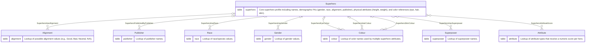

```mermaid
erDiagram
    Superhero {
        table superhero "Core superhero profile including names, demographic FKs (gender, race, alignment, publisher), physical attributes (height, weight), and color references (eye, hair, skin)."
    }
    Alignment {
        table alignment "Lookup of possible alignment values (e.g., Good, Bad, Neutral, N/A)."
    }
    Publisher {
        table publisher "Lookup of publisher names."
    }
    Race {
        table race "Lookup of race/species values."
    }
    Gender {
        table gender "Lookup of gender values."
    }
    Colour {
        table colour "Lookup of color names used by multiple superhero attributes."
    }
    Superpower {
        table superpower "Lookup of superpower names."
    }
    Attribute {
        table attribute "Lookup of attribute types that receive a numeric score per hero."
    }

    %% FROM superhero JOIN alignment ON superhero.alignment_id = alignment.id
    Superhero |o--o{ Alignment : "SuperheroHasAlignment"

    %% FROM superhero JOIN publisher ON superhero.publisher_id = publisher.id
    Superhero |o--o{ Publisher : "SuperheroPublishedByPublisher"

    %% FROM superhero JOIN race ON superhero.race_id = race.id
    Superhero |o--o{ Race : "SuperheroHasRace"

    %% FROM superhero JOIN gender ON superhero.gender_id = gender.id
    Superhero |o--o{ Gender : "SuperheroHasGender"

    %% FROM superhero JOIN colour ON superhero.eye_colour_id = colour.id
    Superhero |o--o{ Colour : "SuperheroEyeColour"

    %% FROM superhero JOIN colour ON superhero.hair_colour_id = colour.id
    Superhero |o--o{ Colour : "SuperheroHairColour"

    %% FROM superhero JOIN colour ON superhero.skin_colour_id = colour.id
    Superhero |o--o{ Colour : "SuperheroSkinColour"

    %% FROM superhero JOIN hero_power ON hero_power.hero_id = superhero.id JOIN superpower ON hero_power.power_id = superpower.id
    Superhero }o--o{ Superpower : "SuperheroHasSuperpower"

    %% FROM superhero JOIN hero_attribute ON hero_attribute.hero_id = superhero.id JOIN attribute ON hero_attribute.attribute_id = attribute.id
    Superhero }o--o{ Attribute : "SuperheroAttributeScore"
```