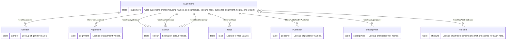

```mermaid
erDiagram
    Superhero {
        table superhero "Core superhero profile including names, demographics, colours, race, publisher, alignment, height, and weight."
    }
    Gender {
        table gender "Lookup of gender values."
    }
    Alignment {
        table alignment "Lookup of alignment values."
    }
    Colour {
        table colour "Lookup of colour values."
    }
    Race {
        table race "Lookup of race values."
    }
    Publisher {
        table publisher "Lookup of publisher names."
    }
    Superpower {
        table superpower "Lookup of superpower names."
    }
    Attribute {
        table attribute "Lookup of attribute dimensions that are scored for each hero."
    }

    %% FROM superhero JOIN gender ON superhero.gender_id = gender.id
    Superhero ||--o{ Gender : "HeroHasGender"

    %% FROM superhero JOIN alignment ON superhero.alignment_id = alignment.id
    Superhero |o--o{ Alignment : "HeroHasAlignment"

    %% FROM superhero JOIN colour ON superhero.eye_colour_id = colour.id
    Superhero ||--o{ Colour : "HeroHasEyeColour"

    %% FROM superhero JOIN colour ON superhero.hair_colour_id = colour.id
    Superhero ||--o{ Colour : "HeroHasHairColour"

    %% FROM superhero JOIN colour ON superhero.skin_colour_id = colour.id
    Superhero ||--o{ Colour : "HeroHasSkinColour"

    %% FROM superhero JOIN race ON superhero.race_id = race.id
    Superhero |o--o{ Race : "HeroHasRace"

    %% FROM superhero JOIN publisher ON superhero.publisher_id = publisher.id
    Superhero |o--o{ Publisher : "HeroPublishedByPublisher"

    %% FROM superhero JOIN hero_power ON superhero.id = hero_power.hero_id JOIN superpower ON hero_power.power_id = superpower.id
    Superhero }o--o{ Superpower : "HeroHasSuperpower"

    %% FROM superhero JOIN hero_attribute ON superhero.id = hero_attribute.hero_id JOIN attribute ON hero_attribute.attribute_id = attribute.id
    Superhero }o--o{ Attribute : "HeroHasAttributeScore"
```