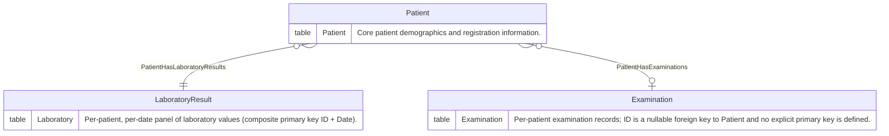

```mermaid
erDiagram
    Patient {
        table Patient "Core patient demographics and registration information."
    }
    LaboratoryResult {
        table Laboratory "Per-patient, per-date panel of laboratory values (composite primary key ID + Date)."
    }
    Examination {
        table Examination "Per-patient examination records; ID is a nullable foreign key to Patient and no explicit primary key is defined."
    }

    %% FROM Patient p JOIN Laboratory l ON l.ID = p.ID
    Patient }o--|| LaboratoryResult : "PatientHasLaboratoryResults"

    %% FROM Patient p LEFT JOIN Examination e ON e.ID = p.ID
    Patient }o--o| Examination : "PatientHasExaminations"
```