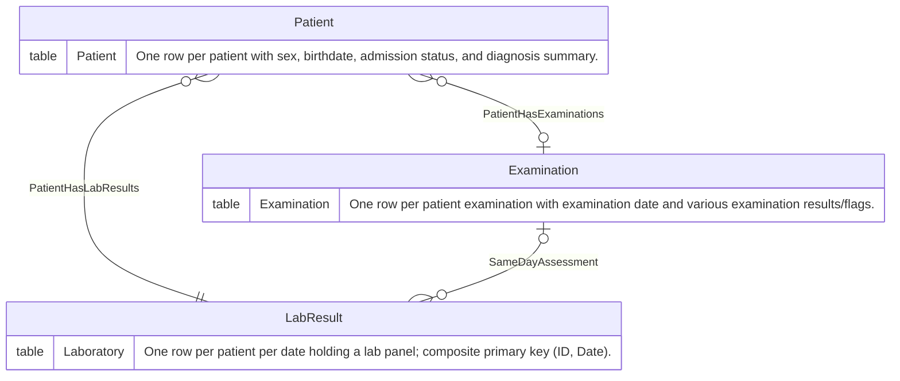

```mermaid
erDiagram
    Patient {
        table Patient "One row per patient with sex, birthdate, admission status, and diagnosis summary."
    }
    Examination {
        table Examination "One row per patient examination with examination date and various examination results/flags."
    }
    LabResult {
        table Laboratory "One row per patient per date holding a lab panel; composite primary key (ID, Date)."
    }

    %% FROM Examination JOIN Patient ON Examination.ID = Patient.ID
    Patient }o--o| Examination : "PatientHasExaminations"

    %% FROM Laboratory JOIN Patient ON Laboratory.ID = Patient.ID
    Patient }o--|| LabResult : "PatientHasLabResults"

    %% FROM Examination JOIN Laboratory ON Examination.ID = Laboratory.ID AND DATE(Examination."Examination Date") = Laboratory.Date
    Examination |o--o{ LabResult : "SameDayAssessment"
```