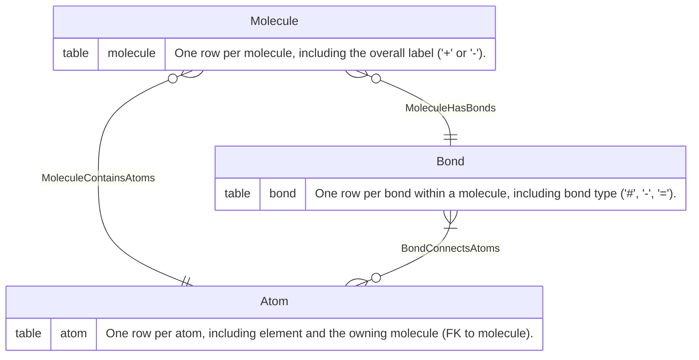

```mermaid
erDiagram
    Molecule {
        table molecule "One row per molecule, including the overall label ('+' or '-')."
    }
    Atom {
        table atom "One row per atom, including element and the owning molecule (FK to molecule)."
    }
    Bond {
        table bond "One row per bond within a molecule, including bond type ('#', '-', '=')."
    }

    Molecule }o--|| Atom : "MoleculeContainsAtoms"
    %% A molecule is composed of atoms; each atom belongs to exactly one molecule.
    %% SQL join path: `FROM molecule JOIN atom ON molecule.molecule_id = atom.molecule_id`

    Molecule }o--|| Bond : "MoleculeHasBonds"
    %% A molecule has bonds; each bond is defined within exactly one molecule.
    %% SQL join path: `FROM molecule JOIN bond ON molecule.molecule_id = bond.molecule_id`

    Bond }|--o{ Atom : "BondConnectsAtoms"
    %% Each bond connects two atoms in its molecule; an atom can participate in multiple bonds.
    %% SQL join path: `FROM bond JOIN connected ON connected.bond_id = bond.bond_id JOIN atom ON atom.atom_id = connected.atom_id`
```