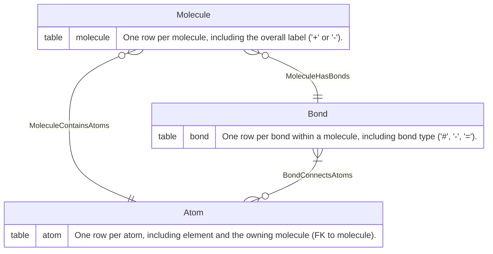

```mermaid
erDiagram
    Molecule {
        table molecule "One row per molecule, including the overall label ('+' or '-')."
    }
    Atom {
        table atom "One row per atom, including element and the owning molecule (FK to molecule)."
    }
    Bond {
        table bond "One row per bond within a molecule, including bond type ('#', '-', '=')."
    }

    %% FROM molecule JOIN atom ON molecule.molecule_id = atom.molecule_id
    Molecule }o--|| Atom : "MoleculeContainsAtoms"

    %% FROM molecule JOIN bond ON molecule.molecule_id = bond.molecule_id
    Molecule }o--|| Bond : "MoleculeHasBonds"

    %% FROM bond JOIN connected ON connected.bond_id = bond.bond_id JOIN atom ON atom.atom_id = connected.atom_id
    Bond }|--o{ Atom : "BondConnectsAtoms"
```