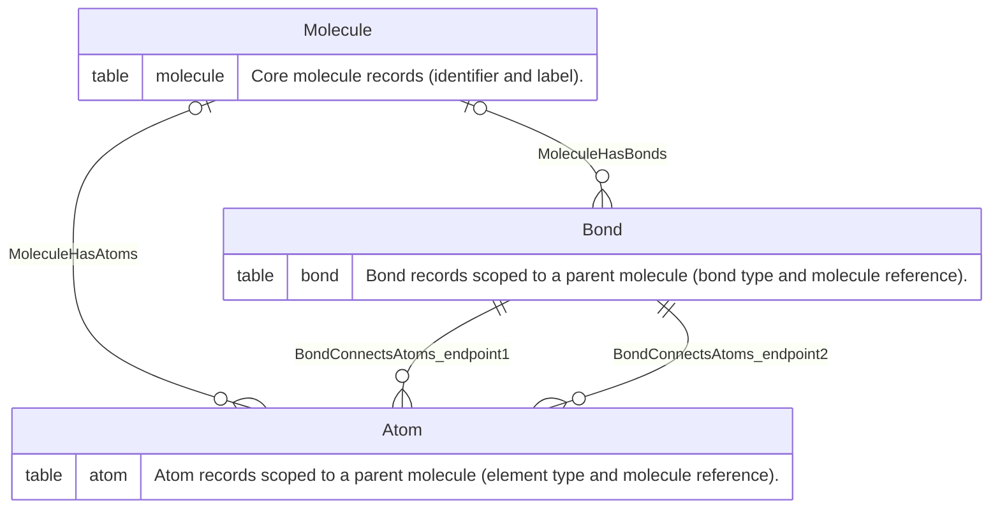

```mermaid
erDiagram
    Molecule {
        table molecule "Core molecule records (identifier and label)."
    }
    Atom {
        table atom "Atom records scoped to a parent molecule (element type and molecule reference)."
    }
    Bond {
        table bond "Bond records scoped to a parent molecule (bond type and molecule reference)."
    }

    %% FROM molecule JOIN atom ON atom.molecule_id = molecule.molecule_id
    Molecule |o--o{ Atom : "MoleculeHasAtoms"

    %% FROM molecule JOIN bond ON bond.molecule_id = molecule.molecule_id
    Molecule |o--o{ Bond : "MoleculeHasBonds"

    %% FROM connected JOIN bond ON connected.bond_id = bond.bond_id JOIN atom AS atom1 ON connected.atom_id = atom1.atom_id AND atom1.molecule_id = bond.molecule_id JOIN atom AS atom2 ON connected.atom_id2 = atom2.atom_id AND atom2.molecule_id = bond.molecule_id
    Bond ||--o{ Atom : "BondConnectsAtoms_endpoint1"
    Bond ||--o{ Atom : "BondConnectsAtoms_endpoint2"
```