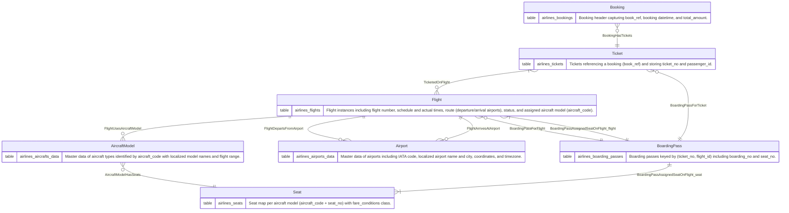

```mermaid
erDiagram
    Flight {
        table airlines_flights "Flight instances including flight number, schedule and actual times, route (departure/arrival airports), status, and assigned aircraft model (aircraft_code)."
    }
    AircraftModel {
        table airlines_aircrafts_data "Master data of aircraft types identified by aircraft_code with localized model names and flight range."
    }
    Airport {
        table airlines_airports_data "Master data of airports including IATA code, localized airport name and city, coordinates, and timezone."
    }
    Booking {
        table airlines_bookings "Booking header capturing book_ref, booking datetime, and total_amount."
    }
    Ticket {
        table airlines_tickets "Tickets referencing a booking (book_ref) and storing ticket_no and passenger_id."
    }
    Seat {
        table airlines_seats "Seat map per aircraft model (aircraft_code + seat_no) with fare_conditions class."
    }
    BoardingPass {
        table airlines_boarding_passes "Boarding passes keyed by (ticket_no, flight_id) including boarding_no and seat_no."
    }

    %% FROM airlines.flights f JOIN airlines.aircrafts_data a ON a.aircraft_code = f.aircraft_code
    Flight ||--o{ AircraftModel : "FlightUsesAircraftModel"

    %% FROM airlines.flights f JOIN airlines.airports_data ap ON ap.airport_code = f.departure_airport
    Flight ||--o{ Airport : "FlightDepartsFromAirport"

    %% FROM airlines.flights f JOIN airlines.airports_data ap ON ap.airport_code = f.arrival_airport
    Flight ||--o{ Airport : "FlightArrivesAtAirport"

    %% FROM airlines.aircrafts_data a JOIN airlines.seats s ON s.aircraft_code = a.aircraft_code
    AircraftModel }o--|| Seat : "AircraftModelHasSeats"

    %% FROM airlines.bookings b JOIN airlines.tickets t ON t.book_ref = b.book_ref
    Booking }o--|| Ticket : "BookingHasTickets"

    %% FROM airlines.ticket_flights tf JOIN airlines.tickets t ON t.ticket_no = tf.ticket_no JOIN airlines.flights f ON f.flight_id = tf.flight_id
    Ticket }|--o{ Flight : "TicketedOnFlight"

    %% FROM airlines.boarding_passes bp JOIN airlines.tickets t ON t.ticket_no = bp.ticket_no
    Ticket }o--|| BoardingPass : "BoardingPassForTicket"

    %% FROM airlines.boarding_passes bp JOIN airlines.flights f ON f.flight_id = bp.flight_id
    Flight }o--|| BoardingPass : "BoardingPassForFlight"

    %% FROM airlines.boarding_passes bp JOIN airlines.flights f ON f.flight_id = bp.flight_id JOIN airlines.seats s ON s.seat_no = bp.seat_no AND s.aircraft_code = f.aircraft_code
    BoardingPass ||--|{ Flight : "BoardingPassAssignedSeatOnFlight_flight"
    BoardingPass ||--|{ Seat : "BoardingPassAssignedSeatOnFlight_seat"
```