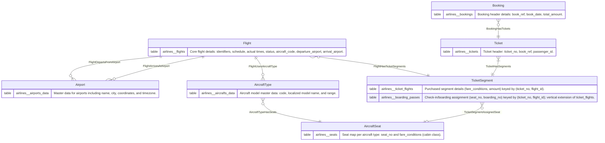

```mermaid
erDiagram
    Flight {
        table airlines__flights "Core flight details: identifiers, schedule, actual times, status, aircraft_code, departure_airport, arrival_airport."
    }
    Airport {
        table airlines__airports_data "Master data for airports including name, city, coordinates, and timezone."
    }
    AircraftType {
        table airlines__aircrafts_data "Aircraft model master data: code, localized model name, and range."
    }
    AircraftSeat {
        table airlines__seats "Seat map per aircraft type: seat_no and fare_conditions (cabin class)."
    }
    Booking {
        table airlines__bookings "Booking header details: book_ref, book_date, total_amount."
    }
    Ticket {
        table airlines__tickets "Ticket header: ticket_no, book_ref, passenger_id."
    }
    TicketSegment {
        table airlines__ticket_flights "Purchased segment details (fare_conditions, amount) keyed by (ticket_no, flight_id)."
        table airlines__boarding_passes "Check-in/boarding assignment (seat_no, boarding_no) keyed by (ticket_no, flight_id); vertical extension of ticket_flights."
    }

    Flight ||--o{ Airport : "FlightDepartsFromAirport"
    %% Each flight departs from exactly one origin airport; an airport can be the origin for many flights.
    %% SQL join path: `FROM airlines.flights f JOIN airlines.airports_data a ON a.airport_code = f.departure_airport`

    Flight ||--o{ Airport : "FlightArrivesAtAirport"
    %% Each flight arrives at exactly one destination airport; an airport can be the destination for many flights.
    %% SQL join path: `FROM airlines.flights f JOIN airlines.airports_data a ON a.airport_code = f.arrival_airport`

    Flight ||--o{ AircraftType : "FlightUsesAircraftType"
    %% Each flight is operated with exactly one aircraft type; an aircraft type can operate many flights.
    %% SQL join path: `FROM airlines.flights f JOIN airlines.aircrafts_data a ON a.aircraft_code = f.aircraft_code`

    AircraftType }o--|| AircraftSeat : "AircraftTypeHasSeats"
    %% An aircraft type defines many seat positions and cabin classes; each seat belongs to exactly one aircraft type.
    %% SQL join path: `FROM airlines.aircrafts_data a JOIN airlines.seats s ON s.aircraft_code = a.aircraft_code`

    Booking }o--|| Ticket : "BookingHasTickets"
    %% A booking may contain multiple tickets; each ticket belongs to exactly one booking.
    %% SQL join path: `FROM airlines.bookings b JOIN airlines.tickets t ON t.book_ref = b.book_ref`

    Ticket }|--|| TicketSegment : "TicketHasSegments"
    %% A ticket comprises one or more ticketed flight segments; each segment is for exactly one ticket.
    %% SQL join path: `FROM airlines.tickets t JOIN airlines.ticket_flights tf ON tf.ticket_no = t.ticket_no`

    Flight }o--|| TicketSegment : "FlightHasTicketSegments"
    %% A flight can have many ticketed segments; each ticketed segment is for exactly one flight.
    %% SQL join path: `FROM airlines.flights f JOIN airlines.ticket_flights tf ON tf.flight_id = f.flight_id`

    TicketSegment }o--o| AircraftSeat : "TicketSegmentAssignedSeat"
    %% A ticketed segment may have a checked-in seat assignment that must exist in the seat map of the operating aircraft type for that flight.
    %% SQL join path: `FROM airlines.ticket_flights tf LEFT JOIN airlines.boarding_passes bp   ON bp.ticket_no = tf.ticket_no AND bp.flight_id = tf.flight_id JOIN airlines.flights f   ON f.flight_id = tf.flight_id JOIN airlines.seats s   ON s.aircraft_code = f.aircraft_code AND s.seat_no = bp.seat_no`
```