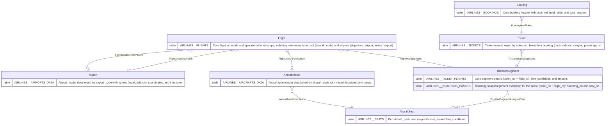

```mermaid
erDiagram
    Flight {
        table AIRLINES__FLIGHTS "Core flight schedule and operational timestamps, including references to aircraft (aircraft_code) and airports (departure_airport, arrival_airport)."
    }
    Airport {
        table AIRLINES__AIRPORTS_DATA "Airport master data keyed by airport_code with names (localized), city, coordinates, and timezone."
    }
    AircraftModel {
        table AIRLINES__AIRCRAFTS_DATA "Aircraft type master data keyed by aircraft_code with model (localized) and range."
    }
    AircraftSeat {
        table AIRLINES__SEATS "Per-aircraft_code seat map with seat_no and fare_conditions."
    }
    Booking {
        table AIRLINES__BOOKINGS "Core booking header with book_ref, book_date, and total_amount."
    }
    Ticket {
        table AIRLINES__TICKETS "Ticket records keyed by ticket_no, linked to a booking (book_ref) and carrying passenger_id."
    }
    TicketedSegment {
        table AIRLINES__TICKET_FLIGHTS "Core segment details (ticket_no + flight_id), fare_conditions, and amount."
        table AIRLINES__BOARDING_PASSES "Boarding/seat assignment extension for the same (ticket_no + flight_id): boarding_no and seat_no."
    }

    Flight }|--o| Airport : "FlightDepartsFromAirport"
    %% Each flight departs from exactly one airport; an airport can be the origin for many flights.
    %% SQL join path: `FROM AIRLINES.FLIGHTS f JOIN AIRLINES.AIRPORTS_DATA a ON a.airport_code = f.departure_airport`

    Flight }|--o| Airport : "FlightArrivesAtAirport"
    %% Each flight arrives at exactly one airport; an airport can be the destination for many flights.
    %% SQL join path: `FROM AIRLINES.FLIGHTS f JOIN AIRLINES.AIRPORTS_DATA a ON a.airport_code = f.arrival_airport`

    Flight }|--o| AircraftModel : "FlightUsesAircraftModel"
    %% Each flight uses one aircraft model; an aircraft model can be used by many flights.
    %% SQL join path: `FROM AIRLINES.FLIGHTS f JOIN AIRLINES.AIRCRAFTS_DATA m ON m.aircraft_code = f.aircraft_code`

    AircraftModel }o--|| AircraftSeat : "AircraftModelHasSeats"
    %% An aircraft model is configured with many seat definitions; each seat belongs to exactly one model.
    %% SQL join path: `FROM AIRLINES.AIRCRAFTS_DATA m JOIN AIRLINES.SEATS s ON s.aircraft_code = m.aircraft_code`

    Booking }|--|| Ticket : "BookingHasTickets"
    %% A booking contains one or more tickets; each ticket belongs to exactly one booking.
    %% SQL join path: `FROM AIRLINES.BOOKINGS b JOIN AIRLINES.TICKETS t ON t.book_ref = b.book_ref`

    Ticket }|--|| TicketedSegment : "TicketIncludesSegments"
    %% A ticket consists of one or more ticketed flight segments; each segment belongs to exactly one ticket.
    %% SQL join path: `FROM AIRLINES.TICKETS t JOIN AIRLINES.TICKET_FLIGHTS tf ON tf.ticket_no = t.ticket_no LEFT JOIN AIRLINES.BOARDING_PASSES bp ON bp.ticket_no = tf.ticket_no AND bp.flight_id = tf.flight_id`

    Flight }o--|| TicketedSegment : "FlightHasSegments"
    %% A flight can have many ticketed segments sold on it; each ticketed segment is for exactly one flight.
    %% SQL join path: `FROM AIRLINES.FLIGHTS f JOIN AIRLINES.TICKET_FLIGHTS tf ON tf.flight_id = f.flight_id LEFT JOIN AIRLINES.BOARDING_PASSES bp ON bp.flight_id = tf.flight_id AND bp.ticket_no = tf.ticket_no`

    TicketedSegment |o--o{ AircraftSeat : "TicketedSegmentAssignedSeat"
    %% A ticketed segment may have a specific seat assigned at boarding; a seat can be assigned across many segments over time.
    %% SQL join path: `FROM AIRLINES.TICKET_FLIGHTS tf LEFT JOIN AIRLINES.BOARDING_PASSES bp ON bp.ticket_no = tf.ticket_no AND bp.flight_id = tf.flight_id JOIN AIRLINES.FLIGHTS f ON f.flight_id = tf.flight_id JOIN AIRLINES.SEATS s ON s.aircraft_code = f.aircraft_code AND s.seat_no = bp.seat_no`
```