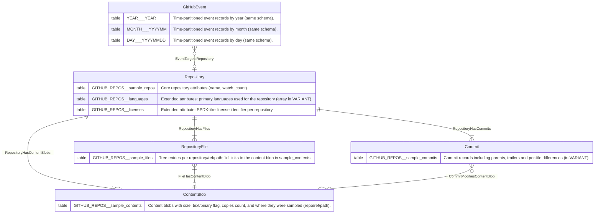

```mermaid
erDiagram
    Repository {
        table GITHUB_REPOS__sample_repos "Core repository attributes (name, watch_count)."
        table GITHUB_REPOS__languages "Extended attributes: primary languages used for the repository (array in VARIANT)."
        table GITHUB_REPOS__licenses "Extended attribute: SPDX-like license identifier per repository."
    }
    ContentBlob {
        table GITHUB_REPOS__sample_contents "Content blobs with size, text/binary flag, copies count, and where they were sampled (repo/ref/path)."
    }
    RepositoryFile {
        table GITHUB_REPOS__sample_files "Tree entries per repository/ref/path; 'id' links to the content blob in sample_contents."
    }
    Commit {
        table GITHUB_REPOS__sample_commits "Commit records including parents, trailers and per-file differences (in VARIANT)."
    }
    GitHubEvent {
        table YEAR___YEAR "Time-partitioned event records by year (same schema)."
        table MONTH___YYYYMM "Time-partitioned event records by month (same schema)."
        table DAY___YYYYMMDD "Time-partitioned event records by day (same schema)."
    }

    Repository ||--|{ RepositoryFile : "RepositoryHasFiles"
    %% A repository contains many file entries (per ref/path) in its tree.
    %% SQL join path: `FROM GITHUB_REPOS.sample_repos r JOIN GITHUB_REPOS.sample_files f ON r.repo_name = f.repo_name`

    Repository ||--|{ Commit : "RepositoryHasCommits"
    %% A repository has many commits in the sample dataset.
    %% SQL join path: `FROM GITHUB_REPOS.sample_repos r JOIN GITHUB_REPOS.sample_commits c ON r.repo_name = c.repo_name`

    Repository ||--|{ ContentBlob : "RepositoryHasContentBlobs"
    %% Content blobs are observed within a specific repository sample (by repo/ref/path).
    %% SQL join path: `FROM GITHUB_REPOS.sample_repos r JOIN GITHUB_REPOS.sample_contents b ON r.repo_name = b.sample_repo_name`

    RepositoryFile }|--o| ContentBlob : "FileHasContentBlob"
    %% A repository file entry points to a specific content blob by its ID; many files (paths/refs) can share the same blob.
    %% SQL join path: `FROM GITHUB_REPOS.sample_files f JOIN GITHUB_REPOS.sample_contents b ON f.id = b.id`

    GitHubEvent }o--o| Repository : "EventTargetsRepository"
    %% An event targets at most one repository, identified via repo.name in the event JSON payload.
    %% SQL join path: `FROM MONTH."_{YYYYMM}" e JOIN GITHUB_REPOS.sample_repos r   ON r.repo_name = e.repo:name::string`

    Commit }o--o{ ContentBlob : "CommitModifiesContentBlob"
    %% A commit modifies zero or more content blobs; links are derived from the per-file differences JSON (new_sha1/old_sha1).
    %% SQL join path: `FROM GITHUB_REPOS.sample_commits c JOIN LATERAL FLATTEN(input => c.difference) d JOIN GITHUB_REPOS.sample_contents b   ON d.value:new_sha1::string = b.id OR d.value:old_sha1::string = b.id`
```