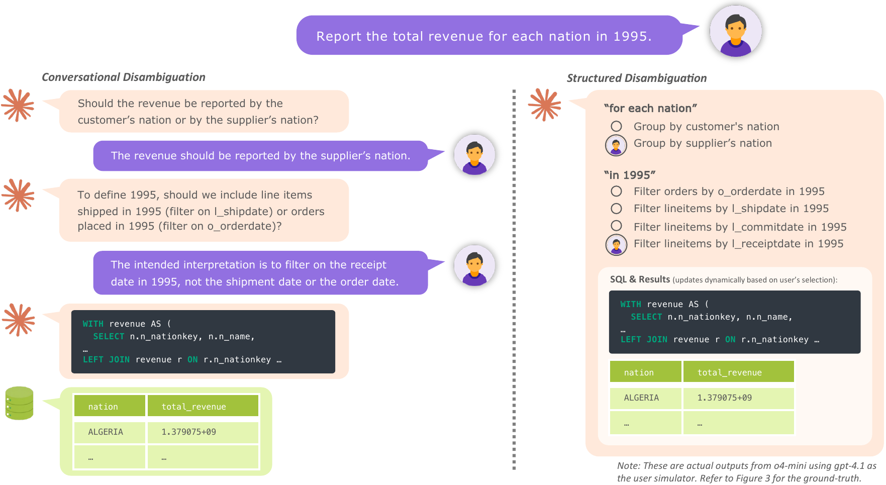

<div align="center">
<h1 align="center">ARCS: Towards Precise Text-to-SQL via Structured Disambiguation</h1>

[🌐 Website](https://megagonlabs.github.io/tabulaflow/research/arcs/) &nbsp;&nbsp; [📄 Paper](https://arxiv.org/pdf/2610.09396) &nbsp;&nbsp; [🤗 Dataset](https://huggingface.co/datasets/megagonlabs/arcs)



</div>

This TabulaFlow repository is the official code repository for the paper
[ARCS: Towards Precise Text-to-SQL via Structured Disambiguation](https://megagonlabs.github.io/tabulaflow/research/arcs/). It
provides the reference implementation for structured dismagiuation and evaluating
the ARCS benchmark.

## 🚀 Quick Start

See the [ARCS setup guide](https://megagonlabs.github.io/tabulaflow/research/benchmarks/#arcs).

## 💻 Code

- [`benchmarks/arcs.py`](benchmarks/arcs.py): dataset installation, task loading,
  and SQLite connectors
- [`agents/ambig_structured.py`](agents/ambig_structured.py): default structured
  ambiguity detection, resolution, and SQL generation agent
- [`agents/ambig_simple.py`](agents/ambig_simple.py): conversational ambiguity
  resolution agent
- [`agents/ambig_flat.py`](agents/ambig_flat.py): flat interpretation-generation
  agent
- [`metrics/ambig_point_stats.py`](metrics/ambig_point_stats.py): ambiguity-point
  and interpretation evaluation
- [`metrics/gold_ambig_point_stats.py`](metrics/gold_ambig_point_stats.py): gold
  ambiguity statistics
- [`../examples/ambiguity_aware_queries.py`](../examples/ambiguity_aware_queries.py):
  end-to-end Python example

## 📚 Citation

```
Coming soon
```
